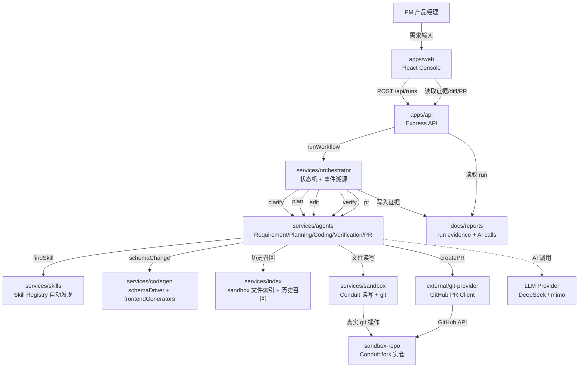
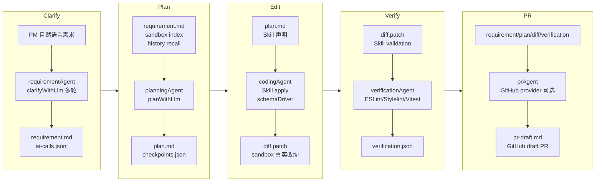

# Architecture

对齐文档仓 [`docs/07-architecture-overview.md`](../../../../docs/07-architecture-overview.md) 与 [`03-spec.md`](../../../../docs/03-spec.md)。
更新时间：**2026-06-09**（补充可视化架构图，满足 §8.2 提交材料清单）。

## 系统全局架构

## 阶段数据流

## Skill 扩展机制

```mermaid
graph TB
    subgraph "新需求接入（零主干侵入）"
        NewReq[新需求模式<br/>例：评论点赞]
        NewSkill[新增 1 个 Skill 文件<br/>commentLikeCountSkill.js]
        Export[导出 commentLikeCountSkill<br/>+ applyCommentLikeCount]
        Registry[registry.js<br/>目录自动发现]
        Agent[codingAgent<br/>findSkill 匹配]
        
        NewReq --> NewSkill
        NewSkill --> Export
        Export -.->|readdir 扫描| Registry
        Registry -->|返回 Skill 列表| Agent
    end
    
    subgraph "Schema-Driven 跨栈"
        Schema[Skill 声明<br/>schemaChange]
        Driver[schemaDriver<br/>解析 Sequelize DDL]
        FE[frontendGenerators<br/>TS type / service / mock]
        Files[自动推断目标文件<br/>无需手写 targetPaths]
        
        Schema --> Driver
        Driver --> FE
        FE --> Files
    end
```

## 阶段数据流

| 阶段 | 输入 | 处理模块 | 输出证据 |
|------|------|----------|----------|
| Clarify | PM 自然语言需求 | `requirementAgent` / `clarifyWithLlm` | `requirement.md`、`ai-calls.jsonl`、多轮时 `clarification-history.jsonl` |
| Plan | Requirement card、sandbox index、history recall | `planningAgent` / `planWithLlm` | `plan.md`、`history-recall.json`、`checkpoints.json` |
| Edit | Plan、Skill 声明、Conduit 文件 | `codingAgent`、`services/skills`、`services/codegen` | `diff.patch`、真实 `sandbox-repo/` 文件改动 |
| Verify | diff、Skill validation、sandbox 命令 | `verificationAgent`、`services/checks` | `verification.json` |
| PR Draft | requirement、plan、diff、verification | `prAgent` / optional GitHub provider | `pr-draft.md` |
| Observe | run evidence、AI call records | API readers + Web panels | 单 run AI Usage、跨 run summary、submission readiness |

## 模块职责

| 模块 | 职责 | §2.2 状态 |
|------|------|-----------|
| `apps/web` | 需求输入、阶段、证据、AI Usage、History、diff、PR、submission、**resume-from-stage** | ✅ H7 |
| `apps/api` | run、history、events、diff、pr、submission、**POST .../resume-from-stage** | ✅ H6 |
| `services/orchestrator` | clarify→plan→edit→verify→pr；**checkpoints** 事件溯源；**U2 `CLARIFYING_AWAITING_ANSWER`** 多轮；**R1** paused 归档治理 | ✅ H5 + U2 + R1 |
| `services/agents` | 需求/计划/编码/验证/PR；rules + **`clarifyWithLlm`** + **U2 `proposeClarifications`/`refineWithAnswers`** + **U3 `planWithLlm`** | ✅ H3–H4 + U2 + U3 |
| `services/skills` | **6 个 Skill**（L1 阅读量、L2 草稿、详情字数、Popular Tags 前 5、**U1 `article-cover-image` schema-driven ≤30 行**、**U5 `comment-like-count` 非列表 ≤50 行**） | ✅ H10–H12 + U1 + U5 |
| `services/codegen` | **U1**：`schemaDriver` 解析 Sequelize → FieldChangeSet；`frontendGenerators` 输出 TS/service/mock | ✅ U1 |
| `services/index` | sandbox 文件索引 + **U4 `embeddingIndex`**（char bigram + 256 维 hash + cosine 的 token 重叠召回，非语义 embedding） | ✅ H8 + U4 |
| `apps/api` | run routes 聚合 + `runExecutionRoutes` / `runEvidenceRoutes` / `runReviewRoutes` / **U2 `runClarificationRoutes`**（`answer-clarification` + `clarification-history`） | ✅ H6 + U2 |
| `services/sandbox` | Conduit 读写、git、npm | ✅ |
| `external/git-provider` | GitHub draft PR | ✅ 契约；H17 远端 PR 为可选项 |

## 扩展点

| 扩展点 | 接入方式 | 主干约束 |
|--------|----------|----------|
| 新需求模式 | 新增 `services/skills/src/<skill>.js`（导出 `<name>Skill` + `apply<Name>`）；`registry.js` 目录自动发现，无需手动注册 | 不改 registry / Orchestrator / Agent 主流程 |
| 新 schema 字段类需求 | Skill 声明 `schemaChange`，由 `schemaDriver` 和 `frontendGenerators` 推断目标文件 | Skill 不手写跨栈 targetPaths |
| 新跨栈检查 | Skill 声明 `crossStackCheck`，Verification Agent 按声明触发 | 不在 verifier 内按 skill id 写分支 |
| 新 AI 阶段调用 | 产出结构化 `ai_call`，由 orchestrator 合并进 `ai-calls.jsonl` | 不补造 tokens / latency / cost |
| 新提交门禁 | 增加独立 `scripts/check-*.mjs`，由 `check:submission-gates` 聚合 | 不把 focused check 误报为完整提交通过 |

## 核心技术栈

| 层级 | 技术 |
|------|------|
| 前端 | React + Vite |
| API | Node.js + Express |
| AI 编排 | JavaScript ESM；Orchestrator + Requirement / Planning / Coding / Verification / PR Agents |
| Skill / Codegen | Skill registry；schemaDriver；frontendGenerators |
| 目标仓库 | Conduit monorepo；前端 React / Vite，后端 Express / Sequelize |
| 验证 | Node test runner；ESLint；Stylelint；Vitest；Web production build |
| 证据与观测 | Markdown / JSON / JSONL run evidence；AI Usage 面板；跨 run summary |

## AI 双路径

| 路径 | 用途 | 状态 |
|------|------|------|
| `AI_MODE=llm`（默认，答辩主路径） | clarify 阶段真实模型调用；当前默认 `deepseek-v4-flash`，历史验收 run 用 `mimo-v2.5` | ✅ `run-2026-05-21T05-58-01-181Z`；U2 多轮 run `run-l3-multi-turn-clarify` |
| `PLAN_MODE=llm`（默认） | plan 阶段真实模型推理与可观测性；当前默认 `deepseek-v4-flash`，历史验收 run 用 `mimo-v2.5` | ✅ `run-plan-llm-driven` |
| `AI_MODE=rules` | 断网应急兜底；`rules-first-p0`，tokens 为 0 | ✅ |

清晰 L1 的 legacy doubao run **不计入** §2.2 #6。

## 历史上下文

`historyRecall.js` 扫描 `requirement.md` / `plan.md`；坏归档标 `degraded` / `skipped`（H1–H2）。plan 阶段写入 **`history_references`**（H8–H9）。U4 后增加 `embeddingIndex` 本地 token 重叠召回（char bigram + hash 向量，非语义 embedding），`history_references` 带 `match_type` 与 `similarity_score`。

## 可观测性

`aiUsage.js` + Web `AiUsagePanel` 解析 `ai-calls.jsonl`；非零 LLM metrics 见 H4 验收 run（H13）。U3 后 `run-plan-llm-driven` 增加 `stage=plan` 非零 tokens。跨 run 汇总只统计 passed run，且要求 `run-summary.json.aiUsage` 与 `ai-calls.jsonl` 汇总一致；失败/不完整归档进入 `skipped`。

## PR 提交

`POST /api/runs/:id/pr` 须 `confirm=true`、`head`、`base` 及 GitHub 配置；无 token 时仅本地 `pr-draft.md`。

## 边界

**代码级 P0**：rules + L1 Skill。**课题答辩**：§2.2 六项代码 / run 证据已归档，但这只说明 H1–H16 本地验收闭合；§8.2 / F-011 的 S7 视频、公开 AI 主仓、Demo / 视频 URL 仍未闭合，见 [`defense-prep.md`](./defense-prep.md)。
